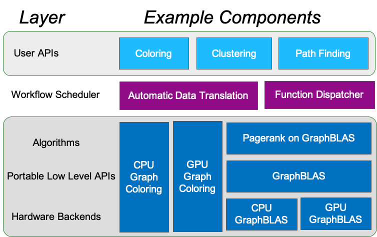

Concepts
========

Metagraph can feel somewhat abstract, but knowing the key concepts will help explain its
purpose and utility while also showing what it is not trying to accomplish.

Design Principles
-----------------

  1. Leverage existing graph analytics libraries and packages
  2. Design for extensibility by different groups
  3. Assume heterogeneity of data formats, hardware, and computational paradigms
  4. Enable users to move between hardware targets with minor code changes

Metagraph is not a typical graph library. Instead, it is an orchestration on top of existing
graph libraries. This allows us to leverage the quality libraries that already exist, while
striving to create a unified API that users can learn.

.. _concepts_decoupling_storage_from_algorithms:

Decoupling Storage from Algorithms
----------------------------------

Metagraph needs to be able to call algorithms from one library using input data from
another library. This gives Metagraph the power to utilize the power of many graph libraries
and expose that power to the user.

However, this required decoupling is not a trivial goal. Graph libraries typically choose a
single format for representing graphs. This format informs the style of how algorithms are
written as well as performance characteristics of those algorithms.

Metagraph's approach is to automatically translate between different data representations,
and then call the algorithm which operates on that new representation. For example, a
pandas edge list can be translated to a networkx Graph, and then a networkx algorithm is
called.

There is a cost to translating, but depending on the size of the graph, the cost of running
the algorithm may overwhelm that translation cost. For example, moving a large graph from
networkx onto a GPU with cugraph opens up extremely performant algorithms. The cost of the
move exists, but the whole operation of translation+computation might take less time than
running the same algorithm on the CPU without translating.

Metagraph Architecture
----------------------

:User APIs​: High level, lazy evaluation APIs that the user interacts with. For example, calling a graph
    coloring algorithm. The user does not specify which specific implementation.
:Workflow Scheduler​: A Dask-based scheduler that matches high level user APIs calls to plugin implementations.
:Algorithms: Specific implementations of user APIs. For example, there might be an implementation
    of Connected Components using GraphBLAS or directly to a specific hardware target written in C++.
:Protable Low Level APIs: These are APIs not suitable for direct use by data scientists, but enable the
    implementation of algorithms in a hardware-portable way. GraphBLAS is a prime example of such an API.
:Hardware Backends: Each portable low level API will need an implementation for whatever hardware Metagraph supports.

