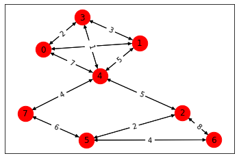

Tutorial
========

This is a brief tutorial of basic Metagraph usage.

First, we import metagraph:

.. code:: ipython3

    >>> import metagraph as mg

Inspecting types and algorithms available
-----------------------------------------

The default resolver automatically pulls in all registered metagraph
plugins

.. code:: ipython3

    >>> res = mg.resolver

A hierarchy of available types is automatically added as properties on ``res``

.. code:: ipython3

    >>> dir(res.types)

    ['DataFrame', 'EdgeMap', 'EdgeSet', 'Matrix', 'NodeMap', 'NodeSet', 'Vector']

For each abstract type, there are several concrete types.

Within a single abstract type, all concrete types are able to represent
equivalent data, but in a different format or data structure.

Here we show the concrete types which represent EdgeMaps.

.. code:: ipython3

    >>> dir(res.types.EdgeMap)

    ['GrblasEdgeMapType',
     'NetworkXEdgeMapType',
     'PandasEdgeMapType',
     'ScipyEdgeMapType']

Algorithms are also be listed under ``r.algos`` and grouped by categories

.. code:: ipython3

    >>> dir(res.algos)

    ['cluster',
     'clustering',
     'link_analysis',
     'subgraph',
     'traversal',
     'vertex_ranking']

.. code:: ipython3

    >>> dir(res.algos.traversal)

    ['all_shortest_paths', 'bellman_ford', 'breadth_first_search', 'dijkstra']

Example Usage
-------------

Let's see how to use metagraph by first constructing a graph from an edge list.

Begin with an input csv file representing the edge list and weights.

.. code:: ipython3

    >>> data = """
    Source,Destination,Weight
    0,1,4
    0,3,2
    0,4,7
    1,3,3
    1,4,5
    2,4,5
    2,5,2
    2,6,8
    3,4,1
    4,7,4
    5,6,4
    5,7,6
    """

Read in the csv file and convert to a Pandas DataFrame.

.. code:: ipython3

    >>> import pandas as pd
    >>> import io
    >>> csv_file = io.StringIO(data)
    >>> df = pd.read_csv(csv_file)

To use the DataFrame within metagraph, we first need to convert it into
a Graph-like object.

We understand that this DataFrame represents a graph’s edges, but
metagraph doesn’t know that yet.

A ``PandasEdgeMap`` takes a DataFrame plus the labels of the columns
representing source and destination nodes. With these, metagraph will
know how to interpret the DataFrame as a Graph.

.. code:: ipython3

    >>> g = res.wrappers.EdgeMap.PandasEdgeMap(df, 'Source', 'Destination', 'Weight', is_directed=False)
    >>> g.value

.. raw:: html

    

    
    <table border="1" class="dataframe">
      <thead>
        <tr style="text-align: right;">
          <th></th>
          <th>Source</th>
          <th>Destination</th>
          <th>Weight</th>
        </tr>
      </thead>
      <tbody>
        <tr>
          <th>0</th>
          <td>0</td>
          <td>1</td>
          <td>4</td>
        </tr>
        <tr>
          <th>1</th>
          <td>0</td>
          <td>3</td>
          <td>2</td>
        </tr>
        <tr>
          <th>2</th>
          <td>0</td>
          <td>4</td>
          <td>7</td>
        </tr>
        <tr>
          <th>3</th>
          <td>1</td>
          <td>3</td>
          <td>3</td>
        </tr>
        <tr>
          <th>4</th>
          <td>1</td>
          <td>4</td>
          <td>5</td>
        </tr>
        <tr>
          <th>5</th>
          <td>2</td>
          <td>4</td>
          <td>5</td>
        </tr>
        <tr>
          <th>6</th>
          <td>2</td>
          <td>5</td>
          <td>2</td>
        </tr>
        <tr>
          <th>7</th>
          <td>2</td>
          <td>6</td>
          <td>8</td>
        </tr>
        <tr>
          <th>8</th>
          <td>3</td>
          <td>4</td>
          <td>1</td>
        </tr>
        <tr>
          <th>9</th>
          <td>4</td>
          <td>7</td>
          <td>4</td>
        </tr>
        <tr>
          <th>10</th>
          <td>5</td>
          <td>6</td>
          <td>4</td>
        </tr>
        <tr>
          <th>11</th>
          <td>5</td>
          <td>7</td>
          <td>6</td>
        </tr>
      </tbody>
    </table>
    

Translate to other Graph formats
--------------------------------

Because metagraph knows how to interpret ``g`` as a Graph, we can easily
convert it other Graph formats.

Let’s convert it to a NetworkX Graph.

.. code:: ipython3

    >>> g2 = res.translate(g, res.wrappers.EdgeMap.NetworkXEdgeMap)
    >>> g2

    <metagraph.plugins.networkx.types.NetworkXEdgeMap at 0x12007f550>

The underlying object (in this case a networkx Graph) is usually stored as the ``.value`` property.

We can verify that the edges are preserved correctly by inspecting the networkx Graph directly.

.. code:: ipython3

    >>> g2.value.edges(data=True)

    EdgeDataView([(0, 1, {'weight': 4}), (0, 3, {'weight': 2}), (0, 4, {'weight': 7}), (1, 3, {'weight': 3}), (1, 4, {'weight': 5}), (3, 4, {'weight': 1}), (4, 2, {'weight': 5}), (4, 7, {'weight': 4}), (2, 5, {'weight': 2}), (2, 6, {'weight': 8}), (5, 6, {'weight': 4}), (5, 7, {'weight': 6})])

We can also convert ``g`` into an adjacency matrix representation using
a GraphBLAS matrix.

The unweighted adjacency matrix has a weight value where an edge exists and is
empty elsewhere.

.. code:: ipython3

    >>> g3 = res.translate(g, res.types.EdgeMap.GrblasEdgeMapType)
    >>> g3

    <metagraph.plugins.graphblas.types.GrblasEdgeMap at 0x11fddb390>

.. code:: ipython3

    >>> g3.show()

    <Matrix 24/(8x8):INT64>

.. raw:: html

    

    
    <table border="1" class="dataframe">
      <thead>
        <tr style="text-align: right;">
          <th></th>
          <th>0</th>
          <th>1</th>
          <th>2</th>
          <th>3</th>
          <th>4</th>
          <th>5</th>
          <th>6</th>
          <th>7</th>
        </tr>
      </thead>
      <tbody>
        <tr>
          <th>0</th>
          <td></td>
          <td>4</td>
          <td></td>
          <td>2</td>
          <td>7</td>
          <td></td>
          <td></td>
          <td></td>
        </tr>
        <tr>
          <th>1</th>
          <td>4</td>
          <td></td>
          <td></td>
          <td>3</td>
          <td>5</td>
          <td></td>
          <td></td>
          <td></td>
        </tr>
        <tr>
          <th>2</th>
          <td></td>
          <td></td>
          <td></td>
          <td></td>
          <td>5</td>
          <td>2</td>
          <td>8</td>
          <td></td>
        </tr>
        <tr>
          <th>3</th>
          <td>2</td>
          <td>3</td>
          <td></td>
          <td></td>
          <td>1</td>
          <td></td>
          <td></td>
          <td></td>
        </tr>
        <tr>
          <th>4</th>
          <td>7</td>
          <td>5</td>
          <td>5</td>
          <td>1</td>
          <td></td>
          <td></td>
          <td></td>
          <td>4</td>
        </tr>
        <tr>
          <th>5</th>
          <td></td>
          <td></td>
          <td>2</td>
          <td></td>
          <td></td>
          <td></td>
          <td>4</td>
          <td>6</td>
        </tr>
        <tr>
          <th>6</th>
          <td></td>
          <td></td>
          <td>8</td>
          <td></td>
          <td></td>
          <td>4</td>
          <td></td>
          <td></td>
        </tr>
        <tr>
          <th>7</th>
          <td></td>
          <td></td>
          <td></td>
          <td></td>
          <td>4</td>
          <td>6</td>
          <td></td>
          <td></td>
        </tr>
      </tbody>
    </table>
    

We can also visualize the graph using functions found in the plugin libraries.

.. code:: ipython3

    >>> import grblas
    >>> grblas.io.draw(g3.value)

Inspect the steps required for translations
-------------------------------------------

Rather than actually converting ``g`` into other formats, let’s ask the
system *how* it will do the conversion. Each conversion requires someone
to write code to convert between the two formats. However, even if there
isn’t a direct translator between two formats, metagraph will find a
path and take several translation steps as needed to perform the task.

The mechanism for viewing the plan is to invoke the translation from
``r.plan.translate`` rather than ``r.translate``. Other than the
additional ``.plan``, the call signature is identical.

--------------

In this first example, there is a direct function which translates
between ``PandasEdgeList`` and ``NetworkXGraphType``

.. code:: ipython3

    >>> res.plan.translate(g, res.types.EdgeMap.NetworkXEdgeMapType)

    [Direct Translation]
    PandasEdgeMapType -> NetworkXEdgeMapType

--------------

In this next example, there is no direct function which convert
``PandasEdgeList`` into a ``GrblasAdjacencyMatrixType``. Instead, we
have to first convert to ``NetworkXGraphType`` and then to
``ScipyAdjacencyMatrixType`` before finally arriving at our desired
format.

While metagraph will do the conversion automatically, understanding the
steps involved helps users plan for expected computation time and memory
usage. If needed, they can also write a plugin to provide a direct
translation path to save time.

.. code:: ipython3

    >>> res.plan.translate(g, res.types.EdgeMap.GrblasEdgeMapType)

    [Multi-step Translation]
    (start)  PandasEdgeMapType
               -> NetworkXEdgeMapType
                 -> ScipyEdgeMapType
     (end)         -> GrblasEdgeMapType

Algorithm Example #1: Triangle Count
------------------------------------

Algorithms are described initially in an abstract definition. For
triangle count, we take a ``Graph`` and return an ``int`` indicating the
number of unique triangles in the graph.

After the abstract definition is written, multiple concrete
implementations are written to operate on concrete types.

Let’s look at the signature and specific implementations available for
triangle count.

.. code:: ipython3

    >>> res.algos.cluster.triangle_count.signatures

    """
    Signature:
        (graph: <metagraph.types.EdgeSet object at 0x106dfd390>) -> int
    Implementations:
        {'graph': <class 'metagraph.plugins.networkx.types.NetworkXEdgeSet'>, 'return': <class 'int'>}
        {'graph': <class 'metagraph.plugins.scipy.types.ScipyEdgeSet'>, 'return': <class 'int'>}
    """

We see that there are two implementations available. One takes a
NetworkX Graph. The other takes a ScipyAdjacencyMatrix.

--------------

Let’s count the triangles with our different representations of ``g``.
We should get the same answer no matter which implementation is chosen.

.. code:: ipython3

    >>> res.algos.cluster.triangle_count(g)

    5

.. code:: ipython3

    >>> res.algos.cluster.triangle_count(g2)

    5

--------------

Similar to how we can view the plan for translations, we can view the
plan for algorithms.

Attempting to run triangle count with a PandasEdgeList will
automatically convert to a NetworkX Graph, then run the algorithm.

.. code:: ipython3

    >>> res.plan.algos.cluster.triangle_count(g)

    nx_triangle_count
    (graph: metagraph.plugins.networkx.types.NetworkXEdgeSet) -> int
    =====================
    Argument Translations
    ---------------------
    ** graph **  [Multi-step Translation]
    (start)  PandasEdgeMapType
               -> NetworkXEdgeMapType
     (end)       -> NetworkXEdgeSetType
    ---------------------

--------------

In the next example, ``g2`` is already a NetworkX Graph, so the only
translation needed is from an EdgeMap to an EdgeSet (i.e. dropping the
weights).

.. code:: ipython3

    >>> res.plan.algos.cluster.triangle_count(g2)

    nx_triangle_count
    (graph: metagraph.plugins.networkx.types.NetworkXEdgeSet) -> int
    =====================
    Argument Translations
    ---------------------
    ** graph **  [Direct Translation]
    NetworkXEdgeMapType -> NetworkXEdgeSetType
    ---------------------

--------------

How do we make metagraph run the triangle_count algorithm written for
scipy adjacency matrix?

Because it finds the networkx version first, it will choose that unless
we start with a scipy matrix.

.. code:: ipython3

    >>> g4 = res.translate(g2, res.types.EdgeMap.ScipyEdgeMapType)
    >>> res.plan.algos.cluster.triangle_count(g4)

    ss_triangle_count
    (graph: metagraph.plugins.scipy.types.ScipyEdgeSet) -> int
    =====================
    Argument Translations
    ---------------------
    ** graph **  [Direct Translation]
    ScipyEdgeMapType -> ScipyEdgeSetType
    ---------------------

--------------

Just to prove that it gives the same result, let’s run it

.. code:: ipython3

    >>> res.algos.cluster.triangle_count(g4)

    5

Algorithm Example #2: Pagerank
------------------------------

Let’s look at the same pieces of information, but for pagerank. Pagerank
takes a Graph and returns a NodeMap, indicating the rank value of each
node in the graph.

First, let’s verify the signature and the implementations available.

We see that there is only one implementation available, which takes a
NetworkX Graph as input.

.. code:: ipython3

    >>> res.algos.link_analysis.pagerank.signatures

    """
    Signature:
        (graph: <metagraph.types.EdgeMap object at 0x106e01750>, damping: float = 0.85, maxiter: int = 50, tolerance: float = 1e-05) -> metagraph.types.NodeMap
    Implementations:
        {'graph': <class 'metagraph.plugins.networkx.types.NetworkXEdgeMap'>, 'damping': <class 'float'>, 'maxiter': <class 'int'>, 'tolerance': <class 'float'>, 'return': <class 'metagraph.plugins.python.types.PythonNodeMap'>}
    """

--------------

Let’s look at the steps required in the plan. Then let’s perform the
computation.

.. code:: ipython3

    >>> res.plan.algos.link_analysis.pagerank(g)

    nx_pagerank
    (graph: metagraph.plugins.networkx.types.NetworkXEdgeMap, damping: float, maxiter: int, tolerance: float) -> metagraph.plugins.python.types.PythonNodeMap
    =====================
    Argument Translations
    ---------------------
    ** graph **  [Direct Translation]
    PandasEdgeMapType -> NetworkXEdgeMapType
    ** damping **
    type
    ** maxiter **
    type
    ** tolerance **
    type
    ---------------------

.. code:: ipython3

    >>> pr = res.algos.link_analysis.pagerank(g)
    >>> pr

    <metagraph.plugins.python.types.PythonNodeMap at 0x1208df0d0>

The result is a PythonNodeMap. Its underlying object is just a dict, so
we can view that easily.

.. code:: ipython3

    >>> pr.value

    {0: 0.11990989117844908,
     1: 0.11990989117844908,
     3: 0.11990989117844908,
     4: 0.1953840289789895,
     2: 0.12919108800740858,
     5: 0.13300793197881575,
     6: 0.09304148578762082,
     7: 0.08964579171181795}

Suppose we want to use the result in a numpy function. We could create
the numpy array from the dict, but there is already a translator
available to do that. Let’s use it.

.. code:: ipython3

    >>> pr_nicer = res.translate(pr, res.types.NodeMap.NumpyNodeMapType)
    >>> pr_nicer.value

    array([0.11990989, 0.11990989, 0.12919109, 0.11990989, 0.19538403,
           0.13300793, 0.09304149, 0.08964579])

