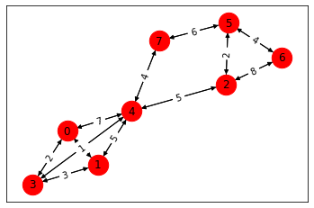

Tutorial
========

Download this as a :download:`notebook </_downloads/notebooks/tutorial.ipynb>`.

This is a brief tutorial of basic Metagraph usage.

First, we import Metagraph:

.. code:: python

    import metagraph as mg

Inspecting Types and Available Algorithms
-----------------------------------------

The default resolver automatically pulls in all registered Metagraph
plugins.

.. code:: python

    >>> res = mg.resolver

A hierarchy of available types is automatically added as properties on
``res``.

.. code:: python

    >>> dir(res.types)

    ['DataFrame', 'EdgeMap', 'EdgeSet', 'Matrix', 'NodeMap', 'NodeSet', 'Vector']

Two important concepts in Metagraph are abstract types and concrete
types.

Abstract types describe a generic kind of data container with
potentially many equivalent representations.

Concrete types describe a specific data object which fits under the
abstract type category.

One can think of abstract types as data container specifications and
concrete types as implementations of those specifications.

For each abstract type, there are several concrete types.

Within a single abstract type, all concrete types are able to represent
equivalent data but in a different format or data structure.

Here we show the concrete types which represent ``EdgeMaps``:

.. code:: python

    >>> dir(res.types.EdgeMap)

    ['GrblasEdgeMapType',
     'NetworkXEdgeMapType',
     'PandasEdgeMapType',
     'ScipyEdgeMapType']

Algorithms are also be listed under ``res.algos`` and grouped by
categories

.. code:: python

    >>> dir(res.algos)

    ['cluster',
     'clustering',
     'link_analysis',
     'subgraph',
     'traversal',
     'vertex_ranking']

.. code:: python

    >>> dir(res.algos.cluster)

    ['triangle_count']

Example Usage
-------------

Let’s see how to use Metagraph by first constructing a graph from an
edge list.

Begin with an input csv file representing the edge list and weights.

.. code:: python

    >>> data = """
    Source,Destination,Weight
    0,1,4
    0,3,2
    0,4,7
    1,3,3
    1,4,5
    2,4,5
    2,5,2
    2,6,8
    3,4,1
    4,7,4
    5,6,4
    5,7,6
    """

Read in the csv file and convert to a Pandas ``DataFrame``.

.. code:: python

    >>> import pandas as pd
    >>> import io
    >>> csv_file = io.StringIO(data)
    >>> df = pd.read_csv(csv_file)

This ``DataFrame`` represents a graph’s edges, but Metagraph doesn’t
know that yet. To use the ``DataFrame`` within Metagraph, we first need
to convert it into a graph-like object.

A ``PandasEdgeMap`` takes a ``DataFrame`` plus the labels of the columns
representing source and destination nodes. With these, Metagraph will
know how to interpret the ``DataFrame`` as a graph.

.. code:: python

    >>> g = res.wrappers.EdgeMap.PandasEdgeMap(df, 'Source', 'Destination', 'Weight', 
                                               is_directed=False)
    >>> g.value

.. raw:: html

    

    
    <table border="1" class="dataframe">
      <thead>
        <tr style="text-align: right;">
          <th></th>
          <th>Source</th>
          <th>Destination</th>
          <th>Weight</th>
        </tr>
      </thead>
      <tbody>
        <tr>
          <th>0</th>
          <td>0</td>
          <td>1</td>
          <td>4</td>
        </tr>
        <tr>
          <th>1</th>
          <td>0</td>
          <td>3</td>
          <td>2</td>
        </tr>
        <tr>
          <th>2</th>
          <td>0</td>
          <td>4</td>
          <td>7</td>
        </tr>
        <tr>
          <th>3</th>
          <td>1</td>
          <td>3</td>
          <td>3</td>
        </tr>
        <tr>
          <th>4</th>
          <td>1</td>
          <td>4</td>
          <td>5</td>
        </tr>
        <tr>
          <th>5</th>
          <td>2</td>
          <td>4</td>
          <td>5</td>
        </tr>
        <tr>
          <th>6</th>
          <td>2</td>
          <td>5</td>
          <td>2</td>
        </tr>
        <tr>
          <th>7</th>
          <td>2</td>
          <td>6</td>
          <td>8</td>
        </tr>
        <tr>
          <th>8</th>
          <td>3</td>
          <td>4</td>
          <td>1</td>
        </tr>
        <tr>
          <th>9</th>
          <td>4</td>
          <td>7</td>
          <td>4</td>
        </tr>
        <tr>
          <th>10</th>
          <td>5</td>
          <td>6</td>
          <td>4</td>
        </tr>
        <tr>
          <th>11</th>
          <td>5</td>
          <td>7</td>
          <td>6</td>
        </tr>
      </tbody>
    </table>
    

Translate to other Graph formats
--------------------------------

Because Metagraph knows how to interpret ``g`` as a graph, we can easily
convert it other graph formats.

Let’s convert it to a NetworkX graph.

.. code:: python

    >>> g2 = res.translate(g, res.wrappers.EdgeMap.NetworkXEdgeMap)
    >>> g2

    <metagraph.plugins.networkx.types.NetworkXEdgeMap at 0x7fcf3e331e50>

The underlying object (in this case a NetworkX graph) is usually stored
as the ``.value`` property.

We can verify that the edges are preserved correctly by inspecting the
NetworkX graph directly.

.. code:: python

    >>> g2.value.edges(data=True)

    EdgeDataView([(0, 1, {'weight': 4}), (0, 3, {'weight': 2}), (0, 4, {'weight': 7}), (1, 3, {'weight': 3}), (1, 4, {'weight': 5}), (3, 4, {'weight': 1}), (4, 2, {'weight': 5}), (4, 7, {'weight': 4}), (2, 5, {'weight': 2}), (2, 6, {'weight': 8}), (5, 6, {'weight': 4}), (5, 7, {'weight': 6})])

We can also convert ``g`` into an adjacency matrix representation using
a GraphBLAS matrix.

The unweighted adjacency matrix has a weight value where an edge exists
and is empty elsewhere.

.. code:: python

    >>> g3 = res.translate(g, res.types.EdgeMap.GrblasEdgeMapType)
    >>> g3

    <metagraph.plugins.graphblas.types.GrblasEdgeMap at 0x7fcf3e3319d0>

.. code:: python

    >>> g3.show()

    <Matrix 24/(8x8):INT64>

.. raw:: html

    

    
    <table border="1" class="dataframe">
      <thead>
        <tr style="text-align: right;">
          <th></th>
          <th>0</th>
          <th>1</th>
          <th>2</th>
          <th>3</th>
          <th>4</th>
          <th>5</th>
          <th>6</th>
          <th>7</th>
        </tr>
      </thead>
      <tbody>
        <tr>
          <th>0</th>
          <td></td>
          <td>4</td>
          <td></td>
          <td>2</td>
          <td>7</td>
          <td></td>
          <td></td>
          <td></td>
        </tr>
        <tr>
          <th>1</th>
          <td>4</td>
          <td></td>
          <td></td>
          <td>3</td>
          <td>5</td>
          <td></td>
          <td></td>
          <td></td>
        </tr>
        <tr>
          <th>2</th>
          <td></td>
          <td></td>
          <td></td>
          <td></td>
          <td>5</td>
          <td>2</td>
          <td>8</td>
          <td></td>
        </tr>
        <tr>
          <th>3</th>
          <td>2</td>
          <td>3</td>
          <td></td>
          <td></td>
          <td>1</td>
          <td></td>
          <td></td>
          <td></td>
        </tr>
        <tr>
          <th>4</th>
          <td>7</td>
          <td>5</td>
          <td>5</td>
          <td>1</td>
          <td></td>
          <td></td>
          <td></td>
          <td>4</td>
        </tr>
        <tr>
          <th>5</th>
          <td></td>
          <td></td>
          <td>2</td>
          <td></td>
          <td></td>
          <td></td>
          <td>4</td>
          <td>6</td>
        </tr>
        <tr>
          <th>6</th>
          <td></td>
          <td></td>
          <td>8</td>
          <td></td>
          <td></td>
          <td>4</td>
          <td></td>
          <td></td>
        </tr>
        <tr>
          <th>7</th>
          <td></td>
          <td></td>
          <td></td>
          <td></td>
          <td>4</td>
          <td>6</td>
          <td></td>
          <td></td>
        </tr>
      </tbody>
    </table>
    

We can also visualize the graph

.. code:: python

    >>> import grblas
    >>> grblas.io.draw(g3.value)

Inspect the steps required for translations
-------------------------------------------

Rather than actually converting ``g`` into other formats, let’s ask
Metagraph how it will do the conversion. Each conversion requires a
translator (written by plugin developers) to convert between the two
formats. However, even if there isn’t a direct translator between two
formats, Metagraph will find a path and take several translation steps
as needed to perform the task.

The mechanism for viewing the plan is to invoke the translation from
``res.plan.translate`` rather than ``res.translate``. Other than the
additional ``.plan``, the call signature is identical.

In this first example, there is a direct function which translates
between ``PandasEdgeMap`` and ``NetworkXEdgeMap``.

.. code:: python

    >>> res.plan.translate(g, res.types.EdgeMap.NetworkXEdgeMapType)

    [Direct Translation]
    PandasEdgeMapType -> NetworkXEdgeMapType

In this next example, there is no direct function which convert
``PandasEdgeMap`` into a ``GrblasEdgeMap``. Instead, we have to first
convert to ``NetworkXEdgeMap`` and then to ``ScipyEdgeMap`` before
finally arriving at our desired format.

While Metagraph will do the conversion automatically, understanding the
steps involved helps users plan for expected computation time and memory
usage. If needed, plugin developers can write a plugin to provide a
direct translation path to save time.

.. code:: python

    >>> res.plan.translate(g, res.types.EdgeMap.GrblasEdgeMapType)

    [Multi-step Translation]
    (start)  PandasEdgeMapType
               -> NetworkXEdgeMapType
                 -> ScipyEdgeMapType
     (end)         -> GrblasEdgeMapType

Algorithm #1: Triangle Count
----------------------------

Algorithms are described initially in an abstract definition. For
triangle count, we take an ``EdgeSet`` and return an ``int`` indicating
the number of unique triangles in the graph.

After the abstract definition is written, multiple concrete
implementations are written to operate on concrete types.

Let’s look at the signature and specific implementations available for
triangle count.

.. code:: python

    >>> res.algos.cluster.triangle_count.signatures

    Signature:
    	(graph: EdgeSet({'is_directed': False})) -> int
    Implementations:
    	{'graph': <class 'metagraph.plugins.scipy.types.ScipyEdgeSet'>, 'return': <class 'int'>}
    	{'graph': <class 'metagraph.plugins.graphblas.types.GrblasEdgeSet'>, 'return': <class 'int'>}
    	{'graph': <class 'metagraph.plugins.networkx.types.NetworkXEdgeSet'>, 'return': <class 'int'>}

We see that there are a few implementations available. They all take
different input graph types, e.g. a ``NetworkXEdgeSet``, a
``ScipyEdgeSet``, etc.

Let’s count the triangles with a few different representations of ``g``.
We should get the same answer no matter which implementation is chosen.

.. code:: python

    >>> res.algos.cluster.triangle_count(g)

    5

.. code:: python

    >>> res.algos.cluster.triangle_count(g2)

    5

We can view the plan for algorithms just like we can view the plan for
translations.

Attempting to run triangle count with a ``PandasEdgeList`` will
automatically convert to a NetworkX graph, then run the algorithm.

.. code:: python

    >>> res.plan.algos.cluster.triangle_count(g)

    nx_triangle_count
    (graph: metagraph.plugins.networkx.types.NetworkXEdgeSet) -> int
    =====================
    Argument Translations
    ---------------------
    ** graph **  [Multi-step Translation]
    (start)  PandasEdgeMapType
               -> NetworkXEdgeMapType
     (end)       -> NetworkXEdgeSetType
    ---------------------

In the next example, ``g2`` is already a NetworkX graph, so the only
translation needed is from an ``EdgeMap`` to an ``EdgeSet``
(i.e. dropping the weights).

.. code:: python

    >>> res.plan.algos.cluster.triangle_count(g2)

    nx_triangle_count
    (graph: metagraph.plugins.networkx.types.NetworkXEdgeSet) -> int
    =====================
    Argument Translations
    ---------------------
    ** graph **  [Direct Translation]
    NetworkXEdgeMapType -> NetworkXEdgeSetType
    ---------------------

How do we make Metagraph run the ``triangle_count`` algorithm written
for Scipy adjacency matrix?

Because it finds the NetworkX version first, it will choose that unless
we start with a Scipy matrix.

.. code:: python

    >>> g4 = res.translate(g2, res.types.EdgeMap.ScipyEdgeMapType)
    >>> res.plan.algos.cluster.triangle_count(g4)

    ss_triangle_count
    (graph: metagraph.plugins.scipy.types.ScipyEdgeSet) -> int
    =====================
    Argument Translations
    ---------------------
    ** graph **  [Direct Translation]
    ScipyEdgeMapType -> ScipyEdgeSetType
    ---------------------

Just to prove that it gives the same result, let’s run it.

.. code:: python

    >>> res.algos.cluster.triangle_count(g4)

    5

Example #2: PageRank
--------------------

Let’s look at the same pieces of information, but for PageRank. PageRank
takes a Graph and returns a ``NodeMap``, indicating the rank value of
each node in the graph.

First, let’s verify the signature and the implementations available.

We see that there are a few implementations available. One takes a
NetworkX graph as input.

.. code:: python

    >>> res.algos.link_analysis.pagerank.signatures

    Signature:
    	(graph: EdgeMap({'dtype': ('float', 'int')}), damping: float = 0.85, maxiter: int = 50, tolerance: float = 1e-05) -> metagraph.types.NodeMap
    Implementations:
    	{'graph': <class 'metagraph.plugins.graphblas.types.GrblasEdgeMap'>, 'damping': <class 'float'>, 'maxiter': <class 'int'>, 'tolerance': <class 'float'>, 'return': <class 'metagraph.plugins.graphblas.types.GrblasNodeMap'>}
    	{'graph': <class 'metagraph.plugins.networkx.types.NetworkXEdgeMap'>, 'damping': <class 'float'>, 'maxiter': <class 'int'>, 'tolerance': <class 'float'>, 'return': <class 'metagraph.plugins.python.types.PythonNodeMap'>}

Let’s look at the steps required in the plan.

.. code:: python

    >>> res.plan.algos.link_analysis.pagerank(g)

    nx_pagerank
    (graph: metagraph.plugins.networkx.types.NetworkXEdgeMap, damping: float, maxiter: int, tolerance: float) -> metagraph.plugins.python.types.PythonNodeMap
    =====================
    Argument Translations
    ---------------------
    ** graph **  [Direct Translation]
    PandasEdgeMapType -> NetworkXEdgeMapType
    ** damping **
    float
    ** maxiter **
    int
    ** tolerance **
    float
    ---------------------

Let’s perform the computation.

.. code:: python

    >>> pr = res.algos.link_analysis.pagerank(g)
    >>> pr

    <metagraph.plugins.python.types.PythonNodeMap at 0x7fcf3cf61c10>

The result is a ``PythonNodeMap``. Its underlying object is just a
``dict``, so we can view that easily.

.. code:: python

    >>> pr.value

    {0: 0.11990989117844908,
     1: 0.11990989117844908,
     3: 0.11990989117844908,
     4: 0.1953840289789895,
     2: 0.12919108800740858,
     5: 0.13300793197881575,
     6: 0.09304148578762082,
     7: 0.08964579171181795}

Suppose we want to use the result in a Numpy function. We could create
the Numpy array from the dict, but there is already a translator
available to do that. Let’s use it.

.. code:: python

    >>> pr_nicer = res.translate(pr, res.types.NodeMap.NumpyNodeMapType)
    >>> pr_nicer.value

    array([0.11990989, 0.11990989, 0.12919109, 0.11990989, 0.19538403,
           0.13300793, 0.09304149, 0.08964579])

