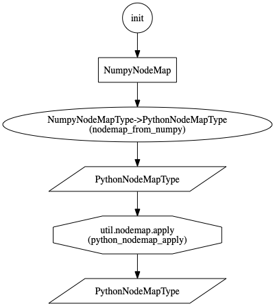
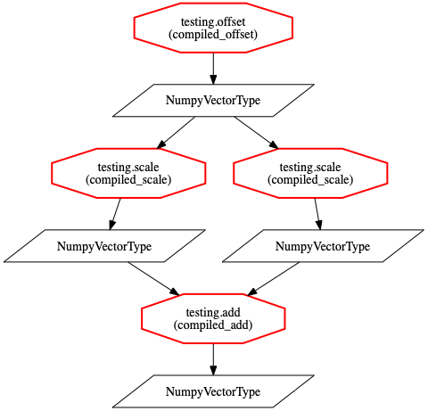
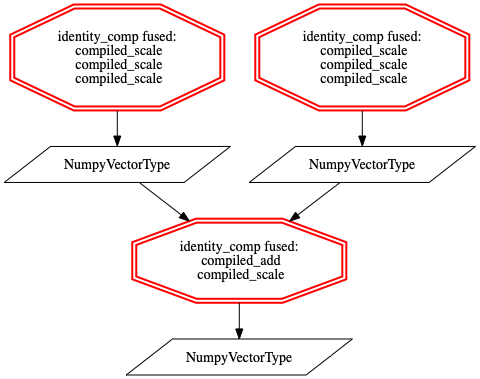
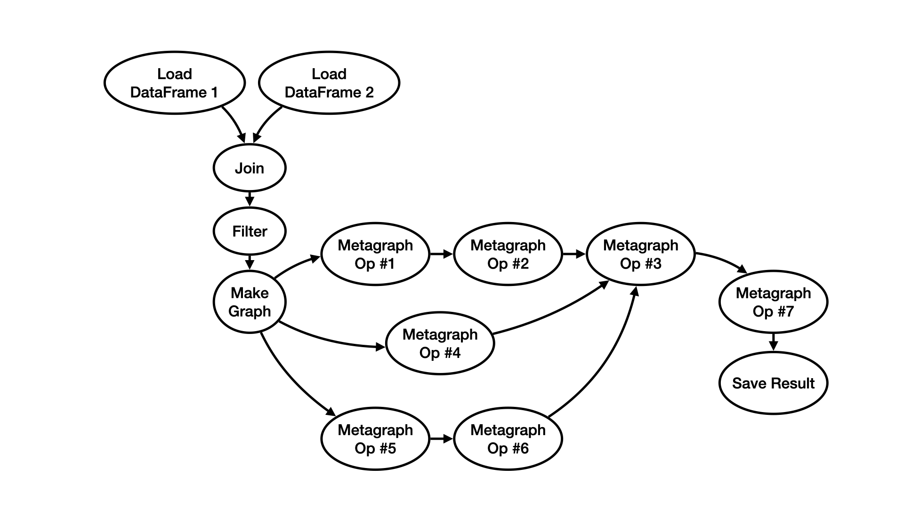
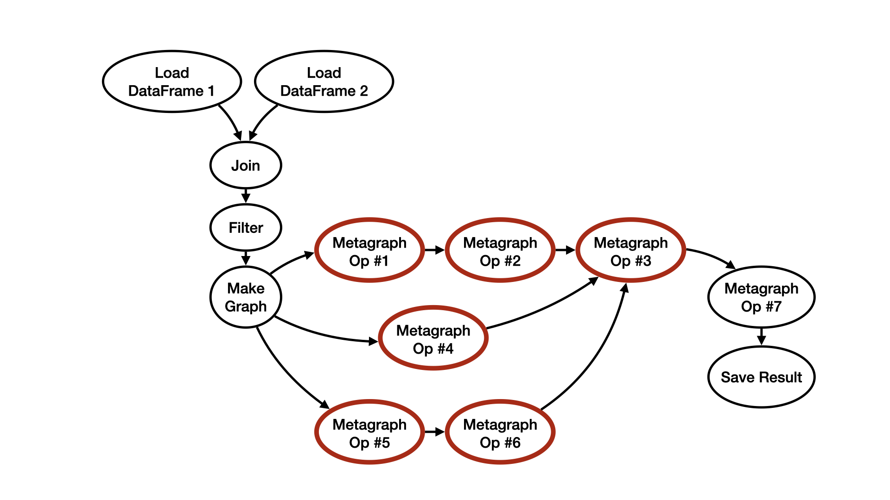
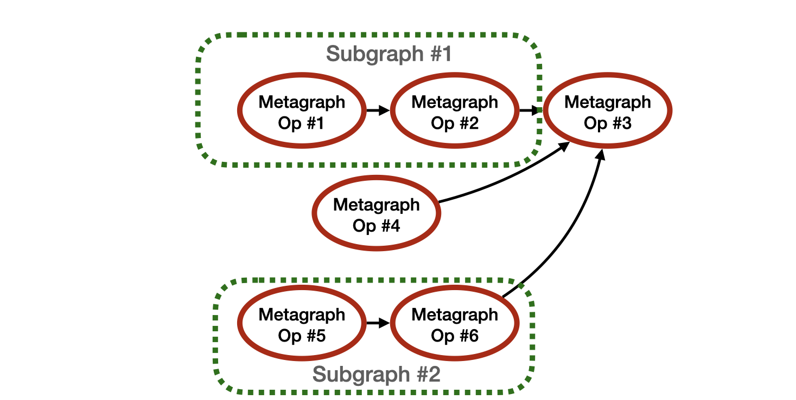
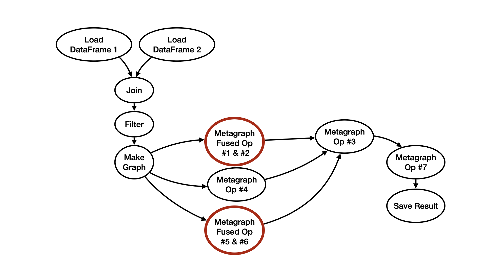

.. _compiler_plugins:

Prerequisite Reading
--------------------

Familiarity with the concepts covered in the following sections are highly recommended:

* :ref:`Algorithms<algorithms>`
* :ref:`Usage with Dask<dask>`

Compiler Plugins
================

Most concrete algorithms in Metagraph are self-contained "black box
implementations" that are run independently by the dispatcher or Dask
scheduler.  However, Metagraph also allows a special kind of concrete
algorithm to be defined which is "compilable."  A compilable algorithm is
described in such a way that a compiler plugin can do just-in-time (JIT)
compilation of the algorithm to a fast, executable form (usually machine
code).  The benefit of JIT compilation is that multiple tasks can be fused
together by the compiler to reduce redundant work and eliminate the Python
call overhead associated with each individual task.

.. note::

    In the future, JIT compilation may also allow specialization of algorithms
    based on input constants.

When using Metagraph with Dask (see :ref:`dask`), a special Dask graph
optimizer is invoked when the ``compute()`` method is called on a
``Placeholder`` object.  This optimizer will scan the Dask task graph for
compilable Metagraph algorithms and identify task subgraphs to send to the
compiler plugin.  Currently, subgraphs must be linear chains of compilable
tasks to ensure that we do not reduce the parallelism of the overall task
graph.  For an overview of DAG optimization concepts, like fusing linear
chains of tasks, see the `Dask optimization documentation`_.

.. _Dask optimization documentation: https://docs.dask.org/en/latest/optimize.html

.. note::

    Metagraph will someday allow compiler plugins targeting backends with
    parallel execution capabilities to request maximal subgraphs for
    compilation, rather than just linear chains.

Creating a Compiler Plugin
--------------------------

A compiler plugin should have the following form:

.. code-block:: python

    from metagraph.core.plugin import Compiler
    class MyCompiler(Compiler):
        def __init__(self):
            super().__init__(name="example_compiler")

        def initialize_runtime(self):
            # if compiler has any runtime setup requirements, do that here
            # calling this multiple times should have no effect
            pass

        def teardown_runtime(self):
            # shutdown and free resources allocated
            pass

        def compile_algorithm(self, algo:ConcreteAlgorithm, literals:Dict[str,Any])->Callable:
            # compile algo return an equivalent Python callable
            #
            # initialize the runtime if the compiler needs it

        def compile_subgraph(self, subgraph: Dict, inputs: List[Hashable], output: Hashable):
            # compile this Dask subgraph into a single Python callable and return it
            # callable inputs will correspond to the keys in the inputs list
            # and the return value should correspond to the output key.
            #
            # initialize the runtime if the compiler needs it

The name of the compiler is used when defining new concrete algorithms, as
shown in the next section.  Initialization and teardown methods are provided
to defer potentially slow or memory intensive setup until the compiler is
first needed.  Note that ``teardown_runtime()`` is not currently called by
Metagraph, but is present to make it possible to reinitialize the plugin for
testing purposes.

The ``compile_algorithm()`` method is used when the user is executing
compilable algorithms immediately from the standard Resolver, whereas the
``compile_subgraph()`` method is used when the user is constructing a Dask DAG
using the DaskResolver.  In the latter scenario, subgraphs may have only one
task.

Compiler plugins return a Python callable that is called from the CPU of the
Dask worker process.  This means that compilers which target accelerators,
like GPUs or other devices, need to generate host-side wrapper code to launch
a compute kernel on the device along with generating the device code itself.
Additionally, this function must be serializable by Dask for transmission to
Dask workers.

Creating a Compilable Concrete Algorithm
----------------------------------------

A compilable concrete algorithm is a concrete algorithm with a ``compiler``
attribute.  This is usually passed to the ``@concrete_algorithm`` decorator

.. code-block:: python

    @concrete_algorithm("example.add_two", compiler="example_compiler")
    def add_two_c(x: int) -> int:
        return x + 2

In order to use this algorithm, the string name given for the compiler must
match the registered name of a compiler plugin in the environment.  The type
annotation of the function signature has the same form as a regular concrete
algorithm, but the function itself will be interpreted by the compiler plugin
rather than run directly.  Different compilers will have different
expectations described in their documentation.  For example the `Numba
compiler plugin`_ expects the function body to be a Numba-compilable
implementation of the algorithm, whereas the `MLIR compiler plugin`_ expects
the decorated function to return a special ``MLIRFunc`` object which contains
the source code of the algorithm to be compiled with MLIR.

.. _Numba compiler plugin: https://metagraph-numba.readthedocs.io
.. _MLIR compiler plugin: https://metagraph-mlir.readthedocs.io

Compilable concrete algorithms should avoid copying significant amounts of
data to or from temporary containers when calling compiled code.  The type
annotation for the function should indicate which concrete types the code can
directly use, and Metagraph's automatic translation system should handle the
translation.  That will ensure the translation step is visible to the user
(and the optimizer) in the Dask task graph, rather than being hidden inside
the implementation of the compiler plugin.

Invoking the Compiler
---------------------

Users will generally not need to interact with or think about the compiler
when using Metagraph.  The optimizer is applied automatically when a Metagraph
``Placeholder`` object is computed.  

If you have a larger DAG that uses Metagraph for an intermediate calculation,
you will have to ask Dask to apply the Metagraph optimizer manually.  To do this:

 .. code-block:: python

    import dask
    import metagraph as mg
    # res is a Dask object with internal Metagraph tasks
    res_opt = dask.optimize(res, optimizations=[mg.optimize])
    answer = res_opt.compute()

The Metagraph optimizer will leave all non-Metagraph tasks unchanged, so it is
always safe to apply.

Visualizing Compilation
-----------------------

Metagraph placeholder objects have a custom ``visualize()`` method which works
the same as the standard `Dask visualize() method`_, but with special shapes
and labels for Metagraph operations.  For example, this DAG:

shows translation steps with ellipses, the concrete type of results with
parallelograms, and algorithms with octagons.

As with optimization, the custom Metagraph visualize method can be used with
any Dask object by calling it directly:

.. code-block:: python

    import metagraph as mg

    mg.visualize(my_dask_object)

When the DAG contains compilable tasks, they will be highlighted with a single
red octagon outline:

And when the optimizer has compiled and fused tasks, the tasks will be shown
in a double octagon outline with a label listing the algorithms that were fused:

By default, the visualizer optimizes the graph before drawing it.  To disable
this, pass ``optimize_graph=False`` to the ``visualize()`` method.

.. _dask visualize() method: https://docs.dask.org/en/latest/graphviz.html

A Compiler Example
------------------

Consider the following example of task graph:

The user who constructed this graph will have in their script a Metagraph
placeholder object which contains a `future
<https://en.wikipedia.org/wiki/Futures_and_promises>`_ representing the result
of“Metagraph Op #7”.  When they pass the future to the “Save Result” function,
which needs to performs I/O, this will call ``dask.compute()`` on the future
to produce the result, and the following actions will happen:

1. Dask will attempt to optimize the graph by calling ``__dask_optimize__()``
on the Metagraph placeholder object.

2. This will invoke the Metagraph optimizer, which will scan the graph for
Metagraph operations that have concrete implementations which have registered
themselves as JIT-compilable with a compiler backend. In our example, the
compilable operations are marked in a bold red outline:

3. The optimizer will use some heuristic to select connected subgraphs from
the compilable nodes.  The current approach fuses maximal linear chains, so as
to not reduce task-level parallelism in the task graph.  These subgraphs are:

Note that compilable subgraphs must not contain any translation operations, as
those are not assumed to have JIT-compilable implementations.  (This could
change in the future.)

4. Each subgraph will be passed to the compiler backend separately, along with
any captured arguments.  The backend will build a subprogram by flattening the
subgraph into a linear call sequence and combining the IR from all of the
operations into a single module.

5. If compilation is successful, the compiler backend will return a newly
generated Python function that calls the necessary unboxing functions for the
inputs, calls the generated machine code for the fused function, and then
calls the boxing function for the result and returns it.  The Metagraph
optimizer will replace the subgraph with this newly generated node.  Note that
for compatibility with the rest of Dask, generated functions need to be
serializable.  Numba achieves this by sending the IR to the worker node and
compiling it there just before execution.

If compilation is not successful, the compiler backend should raise an error.
The Metagraph optimizer will leave the subgraph unchanged, and the tasks will
run individually.

6. The resulting optimized task graph looks like this:

This task graph will be sent to the Dask scheduler for execution.
