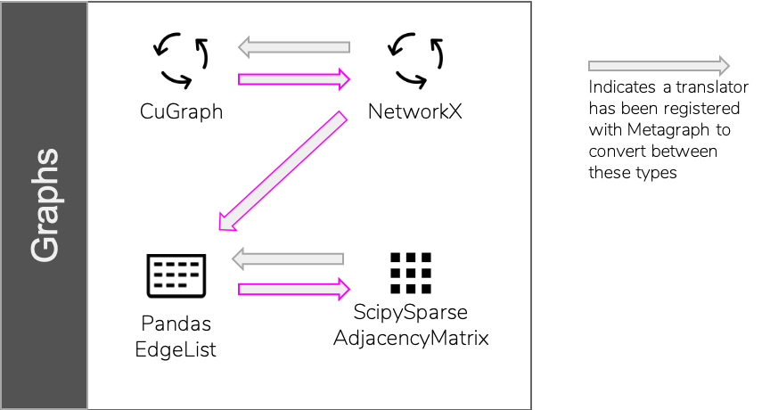
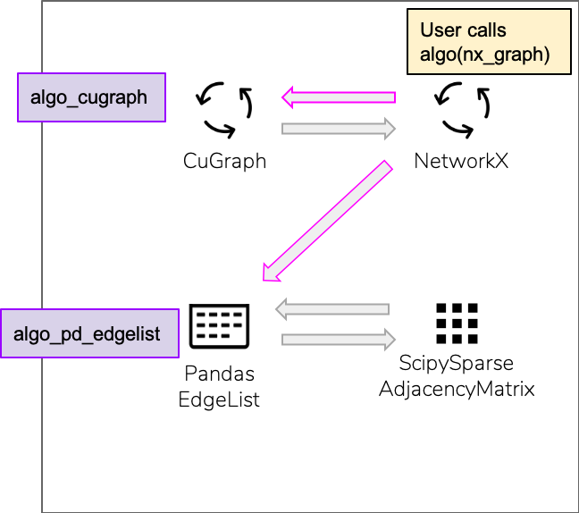

Resolver
============

The Resolver is the component in Metagraph that plugins are registered with.
It acts as the central database when resolving pathways and connections between
the various registered components.

The two most common uses of the resolver by users are:
  1. Translation
  2. Calling an algorithm

Translation
-----------

Translation between two types is performed by calling

.. code-block:: python

    r.translate(x, OutputConcType)

where ``r`` is the resolver, ``x`` is the input object, and ``OutputConcType`` is the concrete type that
describes the output object.

Because there is typically a 1-to-1 relationship between an object and a concrete type,
``OutputConcType`` is also allowed to be the class of the output object.

For example, both of these statements are correct and will yield identical results.

.. code-block:: python

    r.translate(x, r.types.Graph.NetworkXGraphType)
    r.translate(x, r.wrappers.Graph.NetworkXGraph)

The path that is taken to get from the input object to the desired output may take several
steps or may not be possible. The resolver will find all possible paths (determined by translators
registered with the resolver), and choose the shortest path.

Pictorially, the resolver builds a graph of known types and known translations between those types.
When ``r.translate`` is called, it performs a shortest path computation between the input type and
the output type.

In this example, going from CuGraph to ScipySparseAdjacencyMatrix types requires two intermediate hops
because there is no direct translator available.

If no path can be found from the input to the output, an error will be raised.

To view the translation path in a notebook, use ``r.plan``, which mimics the resolver API,
but prints planned work rather than performing the actual work.

.. code-block:: python

    >>> r.plan.translate(x, OutputConcType)
    [Multi-step Translation]
    (start)  SomeInputType
               -> IntermediateType
                 -> Intermediate2Type
     (end)         -> OutputConcType

Calling an algorithm
--------------------

Graph algorithms are called directly from the resolver. They can be called in two ways:
  1. Calling the abstract algorithm and letting the resolver choose the appropriate concrete version
  2. Calling the concrete algorithm directly

Generic Algorithm Call
~~~~~~~~~~~~~~~~~~~~~~

The first approach (calling the abstract algorithm) gives the most flexibility by allowing
the resolver to find available concrete versions and translation paths, and choose the one which
minimizes the number of translations.

.. code-block:: python

    >>> r.algos.clustering.triangle_count(g)
    5

This code compares the type of ``g`` against the concrete algorithms registered for ``triangle_count``.
If the type of ``g`` was an exact match for the signature of one of the algorithms, the resolver calls
that algorithm. Otherwise, a translation path from ``g`` to the required type in one of the algorithms
was found, called, and then the algorithm was run.

To understand this visually, suppose a user calls ``algo`` and passes in a NetworkX graph object.
The system must find concrete versions of ``algo`` which are reachable via translation pathways.

In this example, two concrete versions of ``algo`` have been registered with the system, one for
CuGraph and another which takes Pandas EdgeLists.

The choice of which path to take depends on the number of translations as well as the performance
of the concrete algorithms. Metagraph will attempt to minimize the total time taken.

.. _exact_algorithm_call:

Exact Algorithm Call
~~~~~~~~~~~~~~~~~~~~

The alternative approach is to remove auto-translation of inputs by explicitly calling the desired
concrete algorithm.

This is done by calling the abstract version with the additional suffix of
the plugin name where the concrete version was registered.

For example, the NetworkX version of triangle_count is registered in the ``core_networkx`` plugin.

.. code-block:: python

    >>> r.algos.clustering.triangle_count.core_networkx(g)
    5

This will never translate the input and will instead raise an error if ``g`` is not an instance of
the expected input type for the ``triangle_count`` algorithm registered in the ``core_networkx``
plugin.

An equivalent spelling when calling exact algorithms is:

.. code-block:: python

    >>> r.plugins.core_networkx.algos.clustering.triangle_count(g)
    5

Algorithm Planning
~~~~~~~~~~~~~~~~~~

When calling an algorithm using the generic approach, the calculated steps are made available through
``r.plan``. This shows the full set of translations required, along with the concrete algorithm
chosen.

.. code-block:: python

    >>> r.plan.algos.clustering.triangle_count(g)
    nx_triangle_count
    (graph: metagraph.plugins.networkx.types.NetworkXGraph) -> int
    =====================
    Argument Translations
    ---------------------
    ** graph **  [Multi-step Translation]
    (start)  GrblasGraphType
               -> ScipyGraphType
     (end)       -> NetworkXGraphType
    ---------------------

To see the full list of available concrete algorithms, use the ``signatures`` attribute
on the algorithm. This will show both the abstract signature as well as all known concrete implementations.

.. code-block:: python

    >>> r.algos.clustering.triangle_count.signatures
    Signature:
        (graph: Graph({'is_directed': False})) -> int
    Implementations:
        {'graph': <class 'metagraph.plugins.scipy.types.ScipyGraph'>, 'return': <class 'int'>}
        {'graph': <class 'metagraph.plugins.networkx.types.NetworkXGraph'>, 'return': <class 'int'>}

Default Resolver
----------------

When metagraph is imported, a default resolver is available through ``metagraph.resolver``.
The first time this attribute is accessed, the plugins will be loaded from the environment.
Because of this, the default resolver should be accessed prior to any time-sensitive testing.

.. code-block:: python

    # Typical aliases used in metagraph scripts
    import metagraph as mg
    r = mg.resolver

Usually, the default resolver is sufficient for most scripts using metagraph. However, it is
also possible to create custom resolvers separate from the default resolver. This requires
creating a Resolver and registering plugins manually.

.. code-block:: python

    r2 = mg.core.resolver.Resolver()
    r2.register(some_plugin.registry.find_plugins())

For more information about registry format, see the :ref:`plugin_author_guide`.

The only benefit of using a custom resolver rather than the default one is to limit concrete algorithms
and translations which will be considered when resolving translation and algorithm calls.
