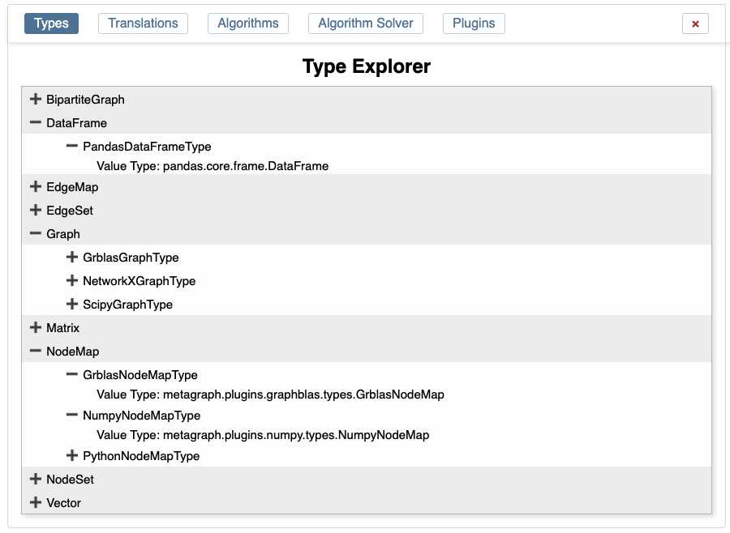
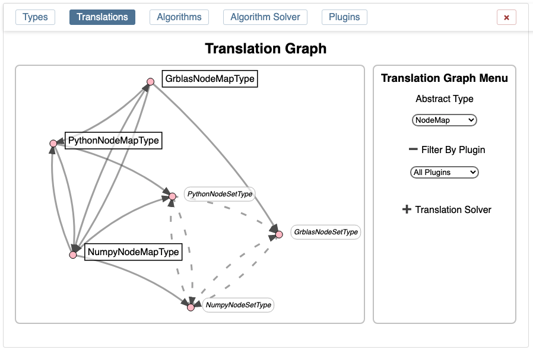
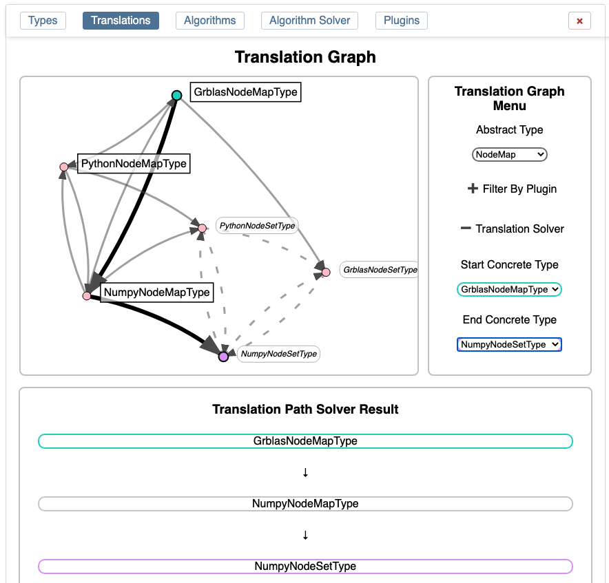
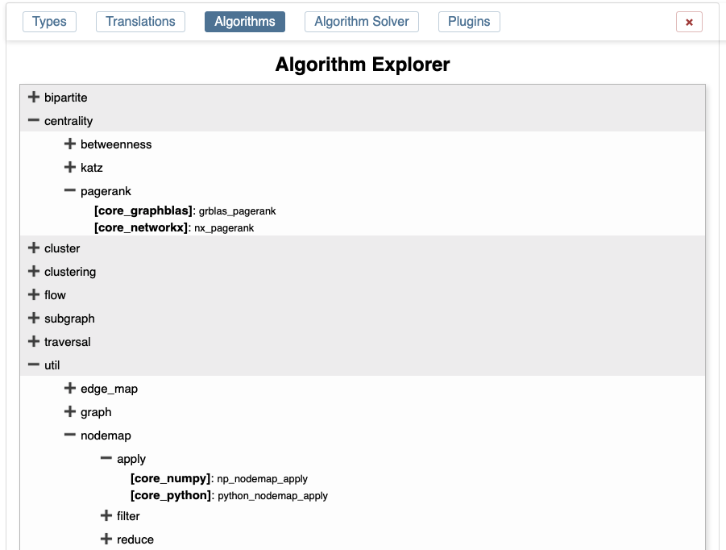
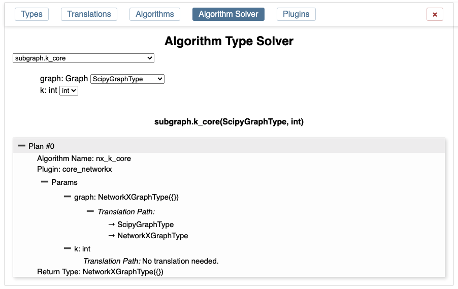
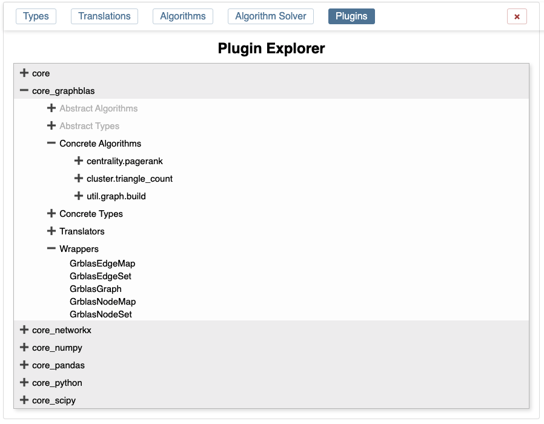

Explorer
========

Metagraph provides a way to explore the types, translators, and algorithms registered with the resolver.
While the resolver will work its magic automatically, it is often helpful to take a look behind the curtain
to see why Metagraph is making the choices it is. The explorer provides this functionality in the browser.

To open the Explorer, call ``resolver.explore()``. Depending on where this is called, the explorer will
open up inline (Jupyter notebook or Jupyter Lab) or in a new tab (other calling contexts or if required
libraries are missing from Jupyter).

Calling from a Notebook
-----------------------

When the explorer is invoked from a notebook, it is displayed like traditional cell output immediately below
the executed cell. The explorer will expand vertically to avoid double panels and the UI confusion that causes.

While not required, it is generally a good practice to close the explorer when finished to free up the screen
space. This is done by clicking on the "x" in the top-right menu in the explorer.

nest_asyncio
~~~~~~~~~~~~

The ``nest_asyncio`` library is required to run the explorer inline in a notebook. This is due to the way
asynchronous threading interacts with Jupyter's use of ``asyncio``. If this library is not installed, a message
will be displayed and the explorer will open in a new tab.

Special Note about Jupyter Lab
~~~~~~~~~~~~~~~~~~~~~~~~~~~~~~

Jupyter Lab typically disallows executing Javascript from within the notebook, which the explorer requires.
The first time the explorer is called in Jupyter Lab, a message "Metagraph explorer load error. Please try again."
will likely be displayed. Running the same command again often will allow the explorer to display inline.

If the message continues, call ``resolver.explorer(False)``. Passing ``False`` will force the explorer to open
in a new tab.

Opening in a New Tab
--------------------

Calling ``resolver.explorer()`` from outside a notebook will open the explorer in a new tab.  Additionally, calling
``resolver.explorer(False)`` will for the explorer to open in a new tab even if invoked from within a notebook.

When opened in a new tab, the call process is blocked until the tab is closed. This is due to the use of ``asyncio``
and websocket communication between the calling process and the Javascript in the new tab.

Besides being in a separate tab, the functionality of the explorer is identical to running inline inside a notebook.

Types
-----

The Types tab shows a list of each abstract type.

Below the abstract type is a list of concrete types which implement the abstract specification.

Below the concrete type are additional details about the concrete type.

Translations
------------

The Translation tab requires choosing an Abstract Type to view. Within that abstract type, all concrete types
and secondary types (defined as other abstract types which the chosen abstract type can be translated to) are
shown. Arrows connect the types to indicate that a translator exists between those types.

Hovering over a type or translator line will show additional information such as which plugin defines the
translator and which Python module contains it.

Another mode is the translation solver. By selecting the start and end type, the explorer will show you the
path Metagraph would choose.

Algorithms
----------

The Algorithms tab shows a list of all abstract type organized hierarchically by their path.

Below the abstract algorithm is a list of concrete implementations.

Algorithm Solver
----------------

The Algorithm Solver tab shows you the choices Metagraph would make to run an algorithm given certain input types.

The abstract algorithm must be chosen first. The list of algorithm arguments will be displayed.

After choosing the concrete type for any argument requiring one, a list of plans will become available.

Expanding the plan will show information about which plugin contains the concrete algorithm. It will also
show each parameter and the list of translations which would be required to get from the input types to the
types required by the concrete implementation.

The return type is also displayed.

Plugins
-------

The Plugins tab shows a list of plugins registered with the Resolver. The top level is the name of each plugin.

Below the plugin is a list of:

- Abstract Algorithms
- Abstract Types
- Concrete Algorithms
- Concrete Types
- Translators
- Wrappers

Below each of those categories is a list of items from that plugin which were registered with the Resolver.

